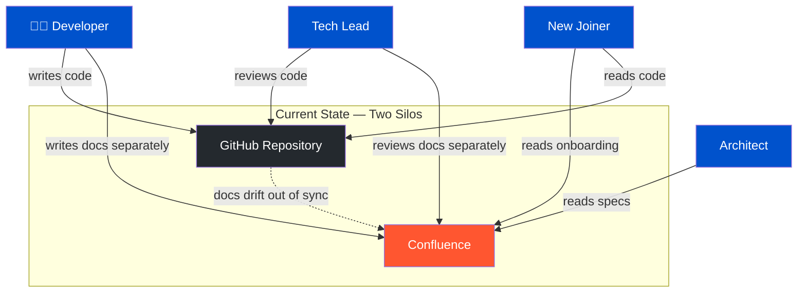
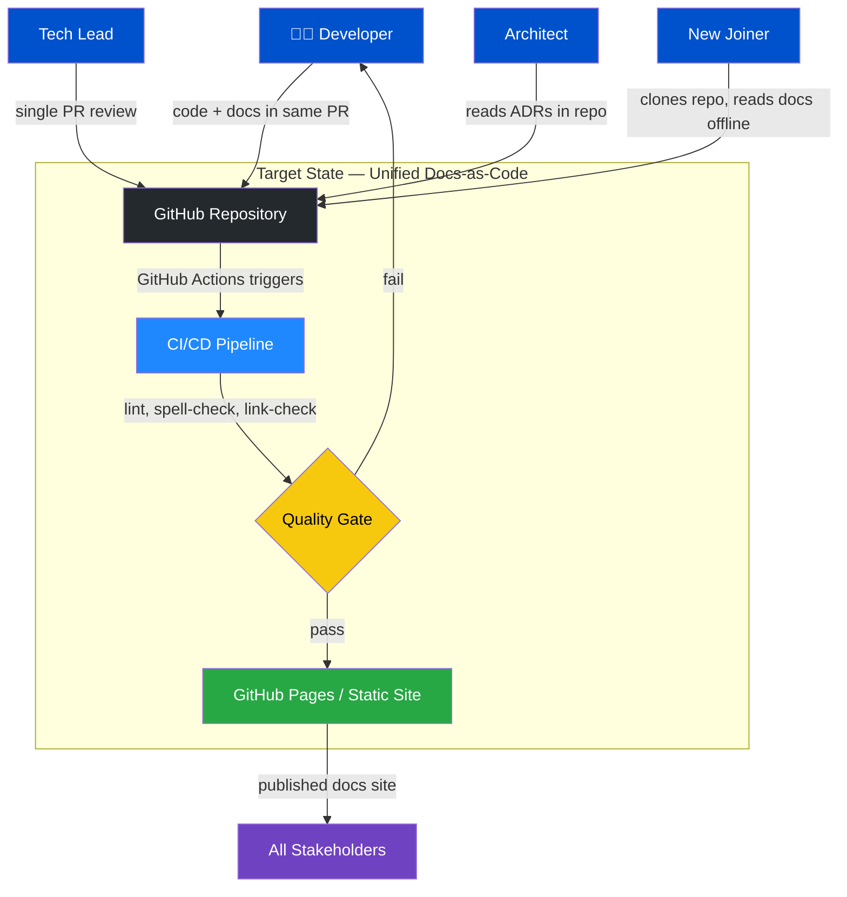
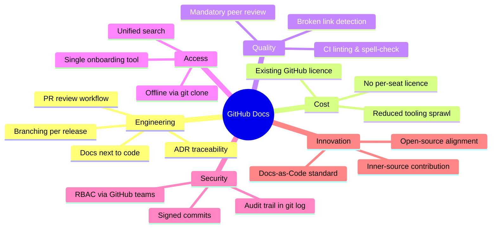
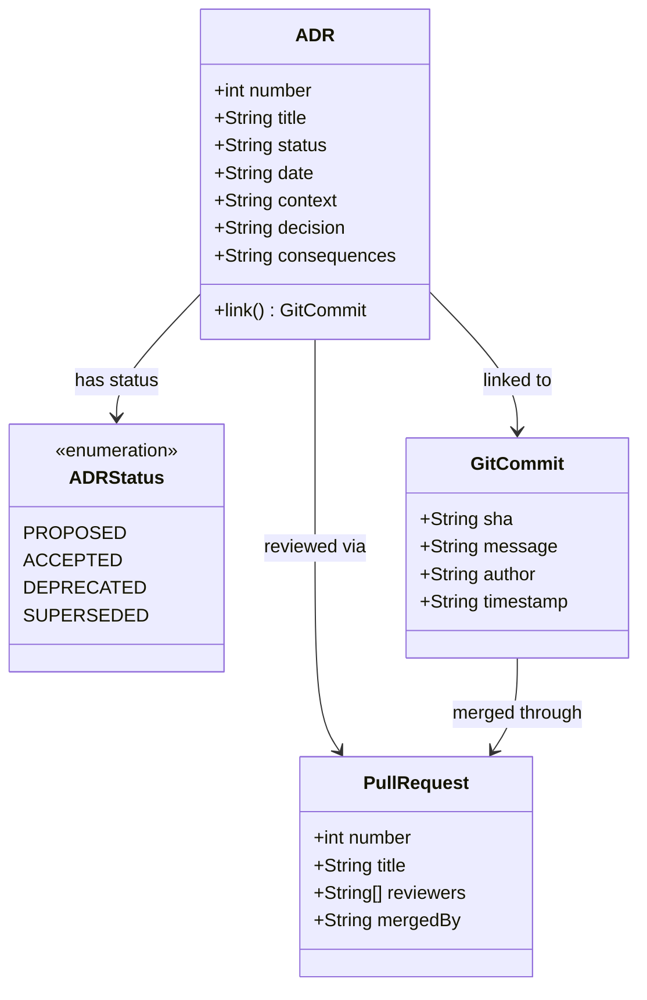
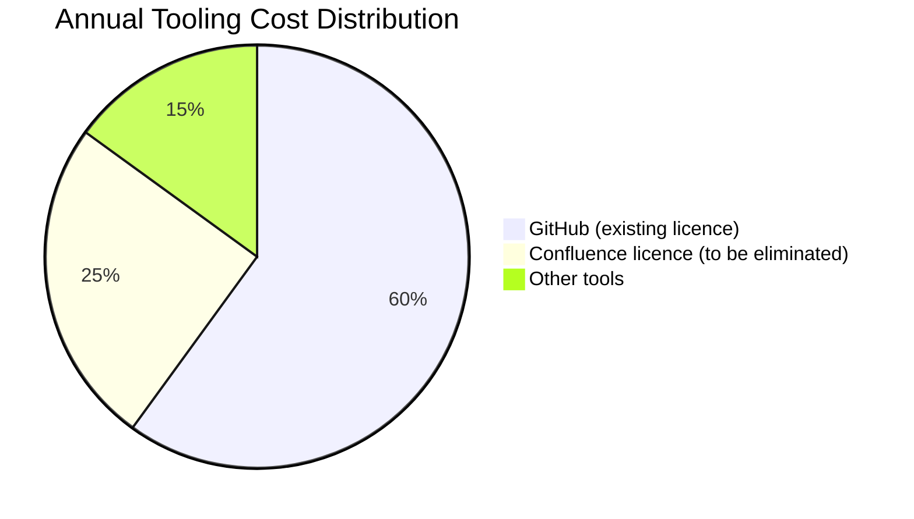
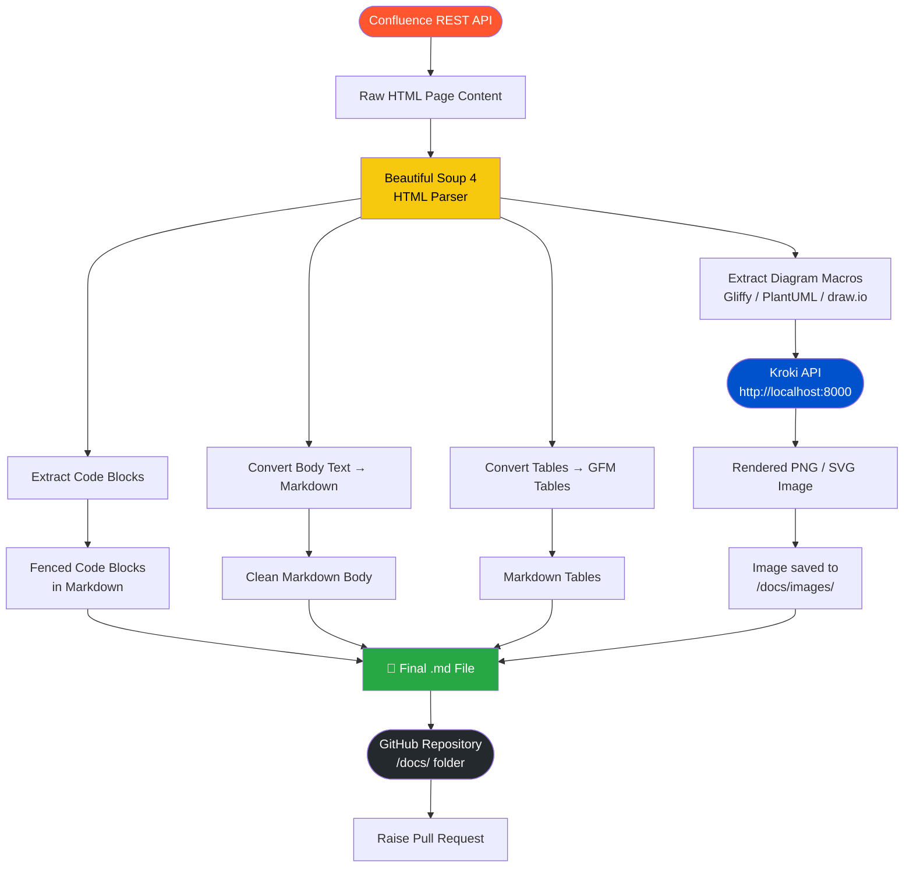
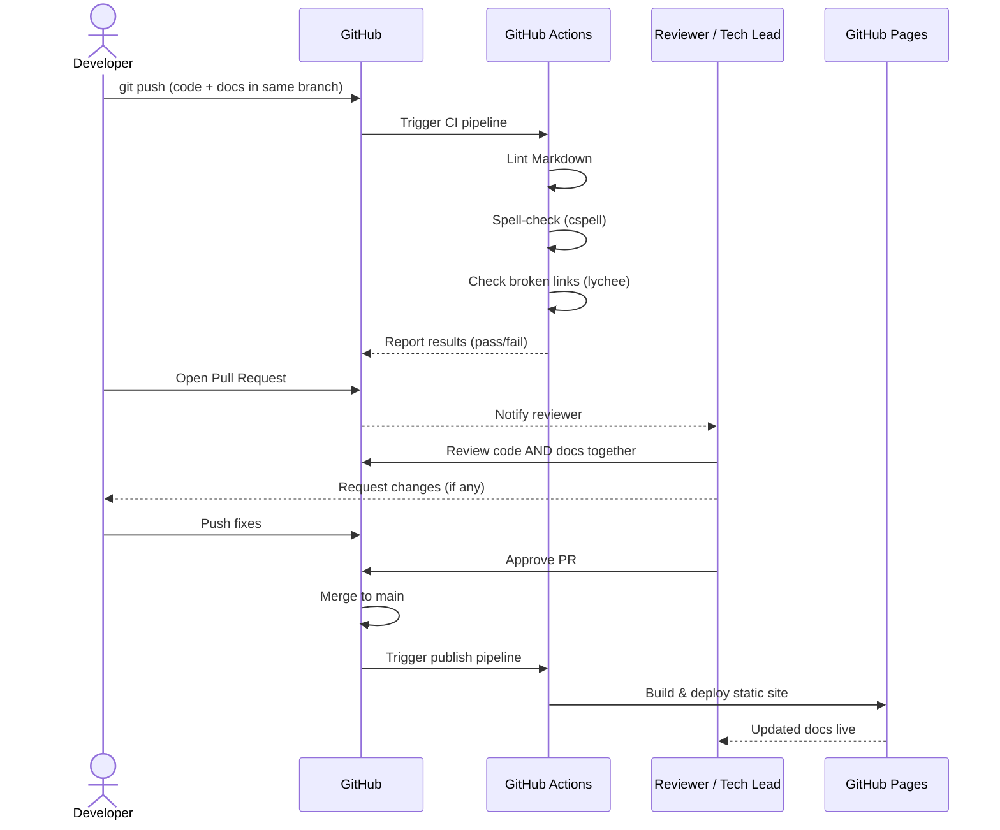
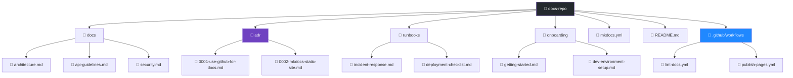
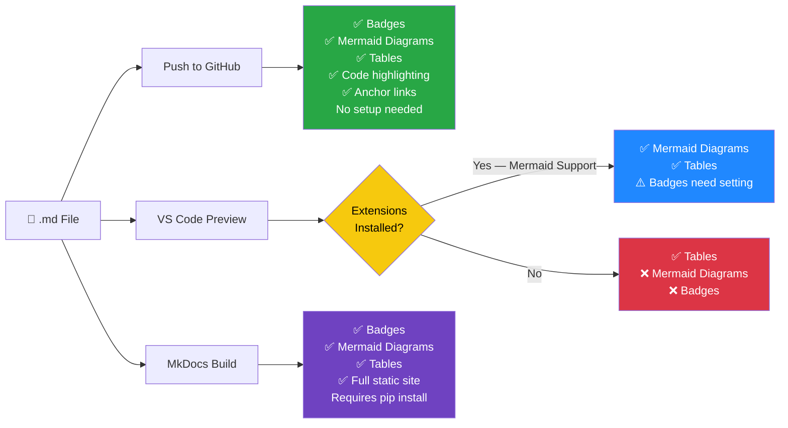

# Proposal: Migrating Documentation from Confluence to GitHub

**Document Type:** Architecture Decision Proposal  
**Date:** April 2, 2026  
**Status:** Proposed  
**Audience:** Architecture Board


---

## Table of Contents

- [Executive Summary](#executive-summary)
- [Problem Statement](#problem-statement)
- [Current State Architecture](#current-state-architecture)
- [Proposed Solution](#proposed-solution)
- [Target State Architecture](#target-state-architecture)
- [Pros and Cons](#pros-and-cons)
- [Key Benefits](#key-benefits)
- [Risk Analysis](#risk-analysis)
- [Migration Approach](#migration-approach)
  - [Migration Timeline](#migration-timeline)
  - [Migration Workflow](#migration-workflow)
- [Automated Migration: Beautiful Soup + Kroki Pipeline](#automated-migration-beautiful-soup--kroki-pipeline)
  - [Pipeline Architecture](#pipeline-architecture)
  - [Diagram Rendering Tools Comparison](#diagram-rendering-tools-comparison)
  - [Python Migration Script](#python-migration-script)
  - [Kroki Self-Hosted Setup](#kroki-self-hosted-setup)
  - [Running the Pipeline](#running-the-pipeline)
- [Pull Request Workflow for Docs](#pull-request-workflow-for-docs)
- [Repository Structure](#repository-structure)
- [Tooling Recommendations](#tooling-recommendations)
- [Success Metrics](#success-metrics)
- [Viewing This Document on GitHub](#viewing-this-document-on-github)
- [Conclusion](#conclusion)
- [Appendix: Comparison Table](#appendix-comparison-table)

---

## Executive Summary

This proposal recommends migrating our team documentation from Atlassian Confluence to GitHub. The move aligns documentation directly with source code, reduces tooling fragmentation, lowers costs, and enables the same engineering workflows (pull requests, code review, versioning) for documentation as we use for code.

---

## Current State Architecture

The diagram below shows the current fragmented documentation landscape, where documentation is disconnected from the codebase.



**Pain points highlighted:** Developers maintain two separate systems. Documentation drifts away from code. No shared review process. Duplicated search effort.

---

## Problem Statement

Our current Confluence-based documentation suffers from several recurring issues:

- **Documentation drift:** Docs live separately from code, so they fall out of date when code changes.
- **No versioning alignment:** There is no native way to tie a doc page to a specific release or branch.
- **Review fatigue:** Confluence has no pull request model, so documentation changes receive little or no peer review.
- **Search fragmentation:** Engineers must search two separate tools — Confluence for docs, GitHub for code.
- **License cost:** Confluence Cloud pricing scales with user seats, adding recurring cost that GitHub (already licensed) does not.

---

## Target State Architecture

The diagram below shows the unified documentation architecture after migration to GitHub.



---

## Proposed Solution

Move all documentation into Markdown files stored within GitHub repositories, following the **docs-as-code** methodology:

- Each repository owns its own documentation under a `/docs` folder or project wiki.
- A shared `docs` repository holds cross-cutting architecture decision records (ADRs), runbooks, and onboarding guides.
- GitHub Pages (or a static site generator such as MkDocs or Docusaurus) publishes content as a browsable site.

---

## Pros and Cons

The tables below provide a balanced view of the migration. The advantages decisively outweigh the drawbacks, particularly given that GitHub is already licensed and used daily by every engineer.

### ✅ Pros — Migrating to GitHub

| # | Topic | Detail |
|---|-------|--------|
| 1 | **Docs next to code** | Documentation and code changes ship in the same pull request, eliminating drift between the two. |
| 2 | **Full Git history** | Every change is versioned with author, timestamp, and commit message — a complete, tamper-evident audit trail. |
| 3 | **Pull request review** | Documentation goes through the same PR approval workflow as code, enforcing quality gates and governance. |
| 4 | **Native CI/CD** | GitHub Actions lints, spell-checks, and link-checks every Markdown file automatically before merge. |
| 5 | **Zero additional licence cost** | GitHub is already licensed across the organisation; Confluence's per-seat fee is eliminated entirely. |
| 6 | **Offline access** | A `git clone` gives engineers full documentation access without a VPN or network connection. |
| 7 | **Open, portable format** | Plain Markdown files are readable in any editor and carry no vendor lock-in. |
| 8 | **Native Mermaid diagrams** | GitHub renders Mermaid diagrams natively in the browser at no cost, replacing paid Confluence diagram macros. |
| 9 | **Unified search** | Engineers search one place — GitHub — for both code and documentation, reducing context switching. |
| 10 | **ADR traceability** | Architecture Decision Records link directly to the commits and PRs that implemented each decision. |
| 11 | **Granular access control** | GitHub Teams and repository visibility settings provide fine-grained RBAC equivalent to or better than Confluence spaces. |
| 12 | **Automated publishing** | GitHub Pages or MkDocs publishes a fully searchable, versioned static site with every merge to `main`. |
| 13 | **Inner-source contribution model** | Any engineer can fork, raise a PR, and contribute documentation improvements using familiar workflows. |
| 14 | **Signed commits and audit trail** | `git log` provides a tamper-evident history of every documentation change, satisfying compliance requirements. |
| 15 | **Consistent developer tooling** | VS Code, GitHub Copilot, and all standard dev tools work natively with Markdown, lowering the barrier to contribution. |

### ⚠️ Cons / Considerations

| # | Topic | Detail | Mitigation |
|---|-------|--------|------------|
| 1 | **Markdown learning curve** | Non-technical writers unfamiliar with Markdown need initial onboarding. | Short workshop + VS Code preview + GitHub Copilot assist eliminates most friction within days. |
| 2 | **Loss of Confluence macros** | Rich macros (status badges, roadmap timelines, inline tasks) have no 1-to-1 Markdown equivalent. | GitHub Discussions covers inline Q&A; MkDocs plugins and shields.io badges replicate most visual macros. |
| 3 | **One-time migration effort** | Existing Confluence pages require export, conversion, and review before cut-over. | The automated Beautiful Soup + Kroki pipeline in this proposal handles the bulk conversion with minimal manual effort. |
| 4 | **No native inline page comments** | Confluence supports inline paragraph-level comments; GitHub does not replicate this outside of PRs. | GitHub Discussions threads can anchor to specific sections; PR comments serve this purpose during the review cycle. |
| 5 | **PR workflow familiarity required** | Contributors must be comfortable with branching and pull requests, which some non-engineering stakeholders may not be. | Provide a one-page "Docs contribution guide" and pair non-technical authors with an engineer during the first few PRs. |

> **Summary:** **15 significant advantages** versus **5 manageable, time-limited drawbacks** — all with clear mitigations. See the [Risk Analysis](#risk-analysis) section for full detail.

---

## Key Benefits

The mind map below summarises all key benefits at a glance:



### 1. Docs Live Next to Code


Documentation lives in the same repository as the code it describes. When a developer changes an API, they update the docs in the same pull request. Reviewers see both changes together, making it nearly impossible for docs to silently fall out of sync.

### 2. Full Version History and Branching


Git gives every document a complete audit trail — who changed what, when, and why. Docs can be branched and merged alongside feature branches, enabling per-release documentation without any manual duplication.

### 3. Pull Request Workflow for Docs


All documentation changes go through the same pull request and code review process the team already uses. This enforces quality gates, enables inline comments, and creates an approval trail that satisfies governance requirements.


### 4. Architecture Decision Records (ADRs)


GitHub is the natural home for ADRs stored as Markdown files. ADRs can be linked directly to the commits or pull requests that implemented the decision, providing permanent traceability.



### 5. Unified Search and Discoverability

Engineers already search GitHub daily. Consolidating documentation there eliminates context switching and makes relevant docs surface naturally in code searches.

### 6. Cost Reduction


Confluence Cloud charges per user seat. GitHub is already licensed across the organisation. Eliminating Confluence reduces SaaS spend without introducing any new tooling.



### 7. Automation and CI/CD Integration


Markdown documentation can be validated, linted, and published automatically via GitHub Actions. Broken links, spelling errors, and formatting issues are caught in CI before merging — something Confluence cannot easily enforce.

### 8. Open-Source and Inner-Source Alignment

The docs-as-code model is the standard in open-source. Teams contributing to or consuming open-source software will find GitHub documentation immediately familiar. Inner-source initiatives benefit from the same contribution model.

### 9. Offline Access

Git repositories are fully cloned locally. Engineers have complete access to all documentation without a network connection or VPN — critical during incidents or travel.

### 10. Reduced Vendor Lock-in

Markdown is a plain-text, open format readable by any editor. Moving away from Confluence's proprietary storage format reduces vendor lock-in and preserves long-term readability of historical documentation.

---

## Risk Analysis

| Risk | Mitigation |
|------|-----------|
| Resistance to Markdown authoring | Provide onboarding sessions; VS Code previews and Copilot assist lower the barrier significantly |
| Loss of Confluence-specific features (macros, inline comments) | Evaluate GitHub Discussions for inline Q&A; static site generators replicate most macro functionality |
| Migration effort for existing content | Use automated Confluence-to-Markdown export tools (e.g., `confluence-to-markdown`); prioritise active pages and archive the rest |
| Search quality | GitHub search covers Markdown natively; a hosted static site adds full-text search |
| Access control | GitHub teams and repository visibility settings provide equivalent or finer-grained access control |

---


---

## Automated Migration: Beautiful Soup + Kroki Pipeline

This section describes a fully automated approach to extract, parse, convert, and render Confluence content into clean GitHub Markdown. It uses two primary tools:

- **[Beautiful Soup 4](https://www.crummy.com/software/BeautifulSoup/)** — A Python library that parses Confluence's HTML output (from the REST API or a raw export) and transforms it into structured Markdown.
- **[Kroki](https://kroki.io/)** — A unified HTTP API that renders 20+ text-based diagram types (PlantUML, Mermaid, GraphViz, D2, and more) to PNG or SVG without local tool installation.

---

### Pipeline Architecture

The diagram below shows the end-to-end automated migration pipeline:



---

### Diagram Rendering Tools Comparison

Kroki is the recommended tool because it covers the widest range of diagram types through a single consistent API. The table below compares it with alternatives:

| Tool | Diagram Types Supported | Output Formats | Deployment | Best For |
|------|------------------------|----------------|------------|----------|
| **Kroki** | 20+ (PlantUML, Mermaid, GraphViz, D2, Structurizr, Excalidraw, …) | PNG, SVG | Docker (self-hosted) or `kroki.io` | Universal: handles any legacy diagram format from Confluence |
| **Mermaid CLI** | Mermaid only | PNG, SVG, PDF | Node.js CLI (`@mermaid-js/mermaid-cli`) | Diagrams already written in Mermaid syntax |
| **PlantUML CLI** | PlantUML only | PNG, SVG, ASCII | Java CLI or Docker | Teams with heavy UML-based legacy diagrams |
| **D2** | D2 language only | PNG, SVG | Go binary | Modern infrastructure / architecture diagrams |
| **draw.io CLI** | draw.io / Gliffy XML | PNG, SVG, PDF | Node.js CLI (`draw.io --export`) | Confluence pages with embedded Gliffy or draw.io diagrams |

> **Recommendation:** Deploy Kroki as a Docker container in your CI environment. It accepts any diagram syntax via HTTP POST and returns a rendered image — no per-diagram tool installation required.

---

### Python Migration Script

The script below automates the entire pipeline: it fetches a Confluence space via the REST API, parses the HTML with Beautiful Soup, converts it to Markdown, extracts embedded diagram macros, renders them via Kroki, and writes the output to a local `/docs` folder ready to commit to GitHub.

```python
"""
confluence_to_github.py

Automated Confluence → GitHub Markdown migration pipeline.
Requirements:
    pip install requests beautifulsoup4 markdownify python-dotenv

Environment variables (.env):
    CONFLUENCE_BASE_URL  = https://your-org.atlassian.net
    CONFLUENCE_API_TOKEN = <Atlassian API token>
    CONFLUENCE_EMAIL     = your-email@example.com
    CONFLUENCE_SPACE_KEY = ENG
    KROKI_BASE_URL       = http://localhost:8000   # or https://kroki.io
    OUTPUT_DIR           = ./docs
"""

import base64
import os
import re
import zlib
from pathlib import Path

import requests
from bs4 import BeautifulSoup
from dotenv import load_dotenv
from markdownify import markdownify as md

load_dotenv()

CONFLUENCE_BASE_URL = os.environ["CONFLUENCE_BASE_URL"]
CONFLUENCE_EMAIL    = os.environ["CONFLUENCE_EMAIL"]
CONFLUENCE_TOKEN    = os.environ["CONFLUENCE_API_TOKEN"]
SPACE_KEY           = os.environ["CONFLUENCE_SPACE_KEY"]
KROKI_BASE_URL      = os.getenv("KROKI_BASE_URL", "https://kroki.io")
OUTPUT_DIR          = Path(os.getenv("OUTPUT_DIR", "./docs"))

AUTH = (CONFLUENCE_EMAIL, CONFLUENCE_TOKEN)
HEADERS = {"Accept": "application/json"}


# ---------------------------------------------------------------------------
# Confluence REST API helpers
# ---------------------------------------------------------------------------

def fetch_all_pages(space_key: str) -> list[dict]:
    """Return all pages in a Confluence space (handles pagination)."""
    pages, start, limit = [], 0, 50
    while True:
        url = (
            f"{CONFLUENCE_BASE_URL}/wiki/rest/api/content"
            f"?spaceKey={space_key}&type=page&expand=body.storage"
            f"&start={start}&limit={limit}"
        )
        resp = requests.get(url, auth=AUTH, headers=HEADERS, timeout=30)
        resp.raise_for_status()
        data = resp.json()
        pages.extend(data["results"])
        if data["start"] + data["limit"] >= data["size"]:
            break
        start += limit
    return pages


# ---------------------------------------------------------------------------
# Diagram rendering via Kroki
# ---------------------------------------------------------------------------

def render_diagram_kroki(
    diagram_type: str, source: str, output_path: Path, fmt: str = "svg"
) -> str:
    """POST diagram source to Kroki and save the rendered image.

    Returns the relative Markdown image reference string.
    """
    # Kroki encodes payloads as deflate-compressed, base64url-encoded strings
    compressed = zlib.compress(source.encode("utf-8"), 9)
    encoded = base64.urlsafe_b64encode(compressed).decode("ascii")
    url = f"{KROKI_BASE_URL}/{diagram_type}/{fmt}/{encoded}"

    resp = requests.get(url, timeout=30)
    resp.raise_for_status()

    output_path.parent.mkdir(parents=True, exist_ok=True)
    output_path.write_bytes(resp.content)
    return str(output_path)


# ---------------------------------------------------------------------------
# Beautiful Soup: extract and replace diagram macros
# ---------------------------------------------------------------------------

CONFLUENCE_MACRO_TO_KROKI: dict[str, str] = {
    "plantuml"     : "plantuml",
    "graphviz"     : "graphviz",
    "mermaid"      : "mermaid",
    "sequence"     : "plantuml",  # Confluence sequence macro → PlantUML
    "structurizr"  : "structurizr",
}


def extract_diagrams(soup: BeautifulSoup, image_dir: Path, page_slug: str) -> None:
    """Find Confluence diagram macros, render them via Kroki in-place."""
    for idx, macro in enumerate(
        soup.find_all("ac:structured-macro")
    ):
        macro_name = macro.get("ac:name", "").lower()
        kroki_type = CONFLUENCE_MACRO_TO_KROKI.get(macro_name)
        if not kroki_type:
            continue

        body = macro.find("ac:plain-text-body")
        if not body:
            continue

        diagram_source = body.get_text()
        img_filename = f"{page_slug}-diagram-{idx + 1}.svg"
        img_path = image_dir / img_filename

        try:
            render_diagram_kroki(kroki_type, diagram_source, img_path)
            # Replace the macro tag with an  so markdownify converts it
            img_tag = soup.new_tag(
                "img",
                src=f"images/{img_filename}",
                alt=f"Diagram {idx + 1}",
            )
            macro.replace_with(img_tag)
            print(f"  [DIAGRAM] Rendered {macro_name} → {img_filename}")
        except requests.RequestException as exc:
            print(f"  [WARN] Kroki rendering failed for {macro_name}: {exc}")
            macro.decompose()  # Remove unrenderable macros rather than leaving raw XML


# ---------------------------------------------------------------------------
# HTML → Markdown conversion
# ---------------------------------------------------------------------------

def confluence_html_to_markdown(html: str, image_dir: Path, page_slug: str) -> str:
    """Parse Confluence storage-format HTML and return clean GitHub Markdown."""
    soup = BeautifulSoup(html, "html.parser")

    # Render diagrams first so their  replacements are picked up by markdownify
    extract_diagrams(soup, image_dir, page_slug)

    # Remove Confluence-specific layout tags that have no Markdown equivalent
    for tag in soup.find_all(["ac:layout", "ac:layout-section", "ac:layout-cell"]):
        tag.unwrap()

    # Convert to Markdown using markdownify (handles tables, headings, code blocks)
    markdown_content = md(
        str(soup),
        heading_style="ATX",       # Use # headings
        bullets="-",               # Use - for unordered lists
        code_language=""          # Preserve code block language hints
    )

    # Normalise excessive blank lines left by macro removal
    markdown_content = re.sub(r"\n{3,}", "\n\n", markdown_content)
    return markdown_content.strip()


# ---------------------------------------------------------------------------
# Slug and filename helpers
# ---------------------------------------------------------------------------

def slugify(title: str) -> str:
    """Convert a page title to a URL/filename-safe slug."""
    slug = title.lower()
    slug = re.sub(r"[^\w\s-]", "", slug)
    slug = re.sub(r"[\s_]+", "-", slug).strip("-")
    return slug


# ---------------------------------------------------------------------------
# Main migration entry point
# ---------------------------------------------------------------------------

def migrate_space(space_key: str) -> None:
    """Migrate all pages in a Confluence space to Markdown files."""
    print(f"Fetching pages from Confluence space: {space_key}")
    pages = fetch_all_pages(space_key)
    print(f"Found {len(pages)} pages.")

    image_dir = OUTPUT_DIR / "images"
    image_dir.mkdir(parents=True, exist_ok=True)

    for page in pages:
        title = page["title"]
        slug  = slugify(title)
        html  = page["body"]["storage"]["value"]

        print(f"\nConverting: {title}")
        markdown = confluence_html_to_markdown(html, image_dir, slug)

        # Prepend a YAML front matter block for MkDocs / static-site generators
        front_matter = f"---\ntitle: \"{title}\"\n---\n\n"
        output_file = OUTPUT_DIR / f"{slug}.md"
        output_file.write_text(front_matter + markdown, encoding="utf-8")
        print(f"  Written → {output_file}")

    print(f"\nMigration complete. {len(pages)} pages written to {OUTPUT_DIR}/")


if __name__ == "__main__":
    migrate_space(SPACE_KEY)
```

---

### Kroki Self-Hosted Setup

For air-gapped or regulated environments, run Kroki as a local Docker container so no diagram source leaves your network:

```yaml
# docker-compose.kroki.yml
services:
  kroki:
    image: yuzutech/kroki:latest
    ports:
      - "8000:8000"
    environment:
      KROKI_BLOCKDIAG_HOST: blockdiag
      KROKI_MERMAID_HOST: mermaid
      KROKI_BPMN_HOST: bpmn
      KROKI_EXCALIDRAW_HOST: excalidraw

  blockdiag:
    image: yuzutech/kroki-blockdiag:latest

  mermaid:
    image: yuzutech/kroki-mermaid:latest

  bpmn:
    image: yuzutech/kroki-bpmn:latest

  excalidraw:
    image: yuzutech/kroki-excalidraw:latest
```

Start the stack with:

```bash
docker compose -f docker-compose.kroki.yml up -d
```

Then set `KROKI_BASE_URL=http://localhost:8000` in your `.env` file before running the migration script.

---

### Running the Pipeline

End-to-end execution steps:

```bash
# 1. Install Python dependencies
pip install requests beautifulsoup4 markdownify python-dotenv

# 2. (Optional) Start local Kroki if not using kroki.io
docker compose -f docker-compose.kroki.yml up -d

# 3. Create .env with your Confluence credentials
cat > .env <<EOF
CONFLUENCE_BASE_URL=https://your-org.atlassian.net
CONFLUENCE_EMAIL=you@example.com
CONFLUENCE_API_TOKEN=<your-atlassian-api-token>
CONFLUENCE_SPACE_KEY=ENG
KROKI_BASE_URL=http://localhost:8000
OUTPUT_DIR=./docs
EOF

# 4. Run the migration
python confluence_to_github.py

# 5. Review output, then commit to GitHub
cd docs
git init
git add .
git commit -m "docs: automated migration from Confluence space ENG"
git remote add origin https://github.com/trravindra/Migration.git
git push -u origin main
```

> **Security note:** Store your Atlassian API token in a secrets manager or CI secret — never commit the `.env` file. Add `.env` to `.gitignore` before the first commit.

---

## Pull Request Workflow for Docs

The sequence diagram below shows how a documentation change flows through the PR process — the same as any code change.



---

## Repository Structure

The recommended folder layout for the shared documentation repository:



---

## Tooling Recommendations

| Purpose | Tool |
|---------|------|
| Content format | Markdown (CommonMark) |
| Static site | MkDocs with Material theme |
| Hosting | GitHub Pages or Azure Static Web Apps |
| CI/CD | GitHub Actions |
| Link checking | `lychee` or `markdown-link-check` |
| Spell checking | `cspell` |
| Export/migration | `confluence-to-markdown` CLI or custom Beautiful Soup pipeline |
| HTML parsing & conversion | Beautiful Soup 4 + `markdownify` (Python) |
| Diagram rendering (all types) | Kroki (self-hosted Docker or `kroki.io`) |
| Diagram rendering (Mermaid only) | Mermaid CLI (`@mermaid-js/mermaid-cli`) |
| Diagrams in GitHub Markdown | Mermaid (renders natively in GitHub Markdown) |

---

## Success Metrics

| Metric | Target |
|--------|--------|
| Documentation coverage (services with up-to-date README/docs) | ≥ 90% within 6 months |
| Docs updated in same PR as code change | ≥ 80% of feature PRs |
| Time to find documentation (engineer survey) | Reduced by ≥ 30% |
| Confluence license cost | Eliminated within 6 months |
| Stale documentation incidents | Reduced by ≥ 50% |

---

## Conclusion

Migrating to GitHub-based documentation is a strategic investment in engineering efficiency and quality. It closes the gap between code and documentation, applies proven engineering discipline (version control, code review, CI/CD) to prose, and reduces tooling sprawl. The migration is low-risk when phased correctly and delivers compounding returns as teams build confidence with the docs-as-code model.

**Recommendation:** Approve the proposal and authorise a two-week pilot starting in the next sprint cycle.

---

## Viewing This Document on GitHub

This document is authored in **GitHub Flavored Markdown (GFM)**. When pushed to a GitHub repository, everything in this file — badges, diagrams, tables, and code blocks — renders natively in the browser with **zero configuration or plugins required**.

The table below explains what each content type looks like locally versus on GitHub:

| Content Type | In a plain text editor | On GitHub (browser) |
|---|---|---|
| Badges (`shields.io`) | Raw `` syntax | Rendered colour badges |
| Mermaid diagrams | Raw ` ```mermaid ``` ` code block | Fully rendered interactive diagram |
| Tables | Pipe-separated text | Formatted grid table |
| Code blocks | Plain fenced text | Syntax-highlighted code |
| Anchor links (TOC) | Plain `[text](#anchor)` | Clickable jump links |
| Headings | `## text` | Formatted headings with auto anchor |

### How to Push This Document to GitHub

#### Step 1 — Create a repository

Go to [github.com/new](https://github.com/new) and create a new repository (e.g. `team-docs` or `migration-proposal`). Set visibility to **Private** for internal proposals.

#### Step 2 — Initialise git locally

Open a terminal in the folder containing this file and run:

```bash
git init
git add confluence-to-github-migration-proposal.md
git commit -m "docs: add Confluence to GitHub migration proposal"
```

#### Step 3 — Push to GitHub

```bash
git remote add origin https://github.com/trravindra/Migration.git
git branch -M main
git push -u origin main
```

#### Step 4 — Share the rendered URL

Once pushed, navigate to the file in your browser:

```
https://github.com/trravindra/Migration/blob/main/confluence-to-github-migration-proposal.md
```

Share this URL with the Architecture Board. They will see the full rendered document — badges, all Mermaid UML diagrams, Gantt chart, sequence diagram, mind map, pie chart, and tables — directly in the browser without installing anything.

### What Renders Where



> **Recommendation for this proposal:** Push to a private GitHub repository and share the rendered URL with architects. This requires no installation, proves the concept in practice, and delivers the best rendering experience.

---

## Appendix: Comparison Table

| Capability | Confluence | GitHub (Markdown + Pages) |
|------------|-----------|--------------------------|
| Version history | Page history only | Full Git history |
| Branch-aligned docs | Not supported | Native |
| Pull request review | Not supported | Native |
| CI/CD integration | Limited | Native (GitHub Actions) |
| Offline access | No | Yes (local clone) |
| Cost | Per-seat licence | Included in existing licence |
| Vendor lock-in | High (proprietary format) | Low (plain Markdown) |
| Diagram support | Paid macros | Mermaid (free, built-in) |
| Search | Confluence only | GitHub + static site |
| ADR traceability | Manual | Linked to commits/PRs |
