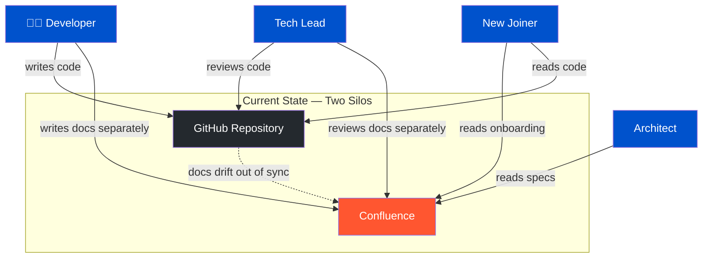
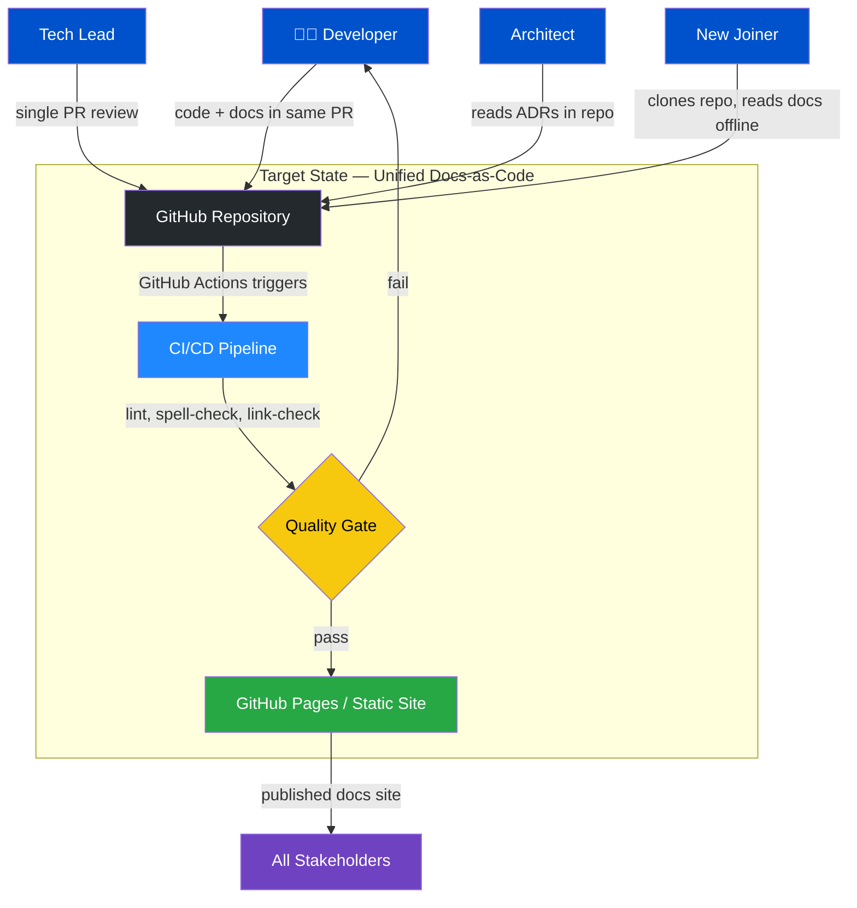
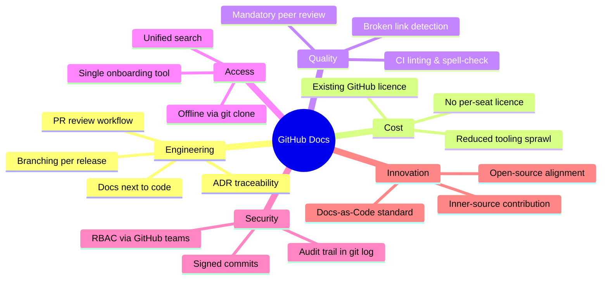
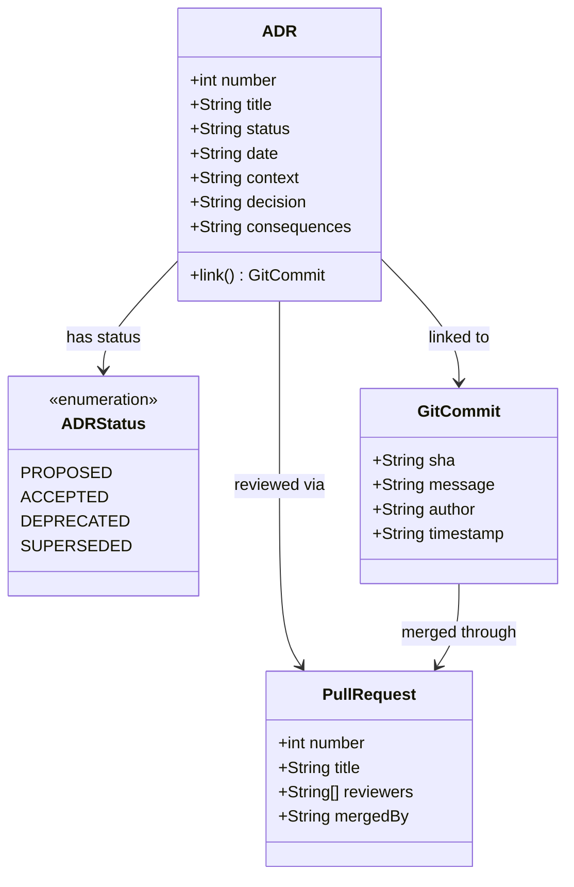
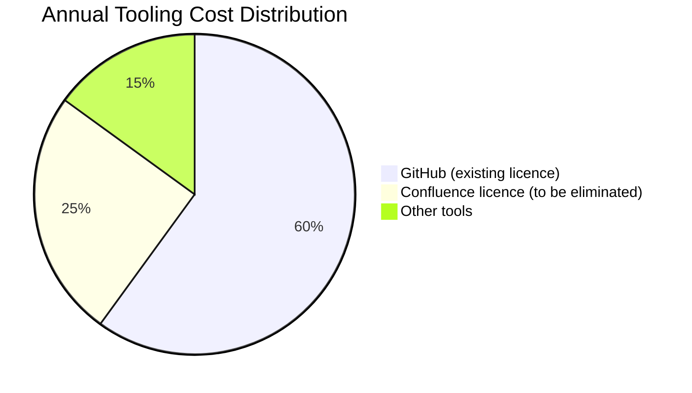
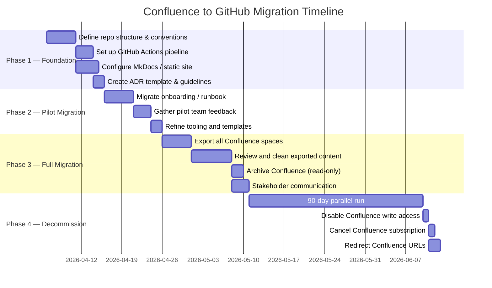
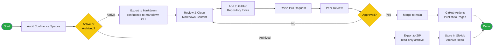
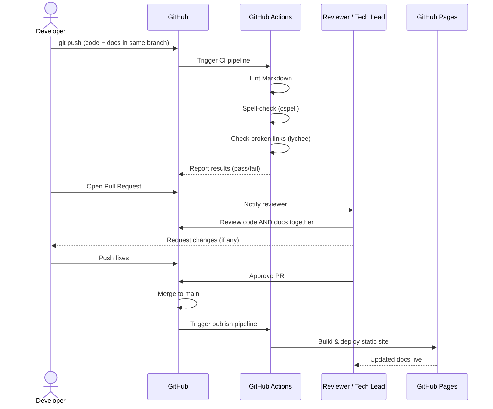
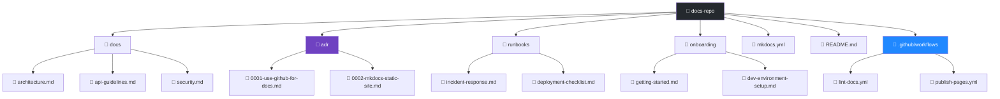
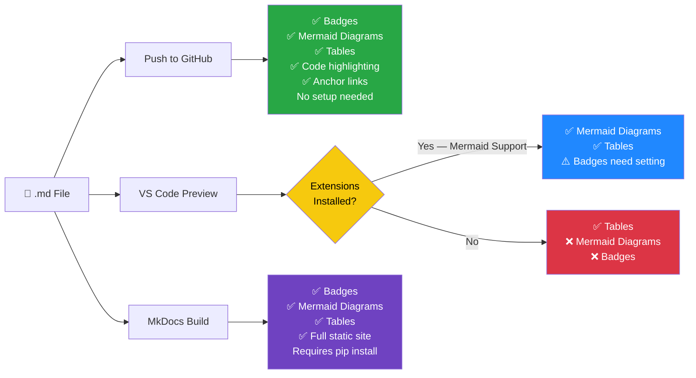

# Proposal: Migrating Documentation from Confluence to GitHub

**Document Type:** Architecture Decision Proposal  
**Date:** April 2, 2026  
**Status:** Proposed  
**Audience:** Architecture Board


---

## Table of Contents

- [Executive Summary](#executive-summary)
- [Problem Statement](#problem-statement)
- [Current State Architecture](#current-state-architecture)
- [Proposed Solution](#proposed-solution)
- [Target State Architecture](#target-state-architecture)
- [Key Benefits](#key-benefits)
- [Risk Analysis](#risk-analysis)
- [Migration Approach](#migration-approach)
  - [Migration Timeline](#migration-timeline)
  - [Migration Workflow](#migration-workflow)
- [Pull Request Workflow for Docs](#pull-request-workflow-for-docs)
- [Repository Structure](#repository-structure)
- [Tooling Recommendations](#tooling-recommendations)
- [Success Metrics](#success-metrics)
- [Viewing This Document on GitHub](#viewing-this-document-on-github)
- [Conclusion](#conclusion)
- [Appendix: Comparison Table](#appendix-comparison-table)

---

## Executive Summary

This proposal recommends migrating our team documentation from Atlassian Confluence to GitHub. The move aligns documentation directly with source code, reduces tooling fragmentation, lowers costs, and enables the same engineering workflows (pull requests, code review, versioning) for documentation as we use for code.

---

## Current State Architecture

The diagram below shows the current fragmented documentation landscape, where documentation is disconnected from the codebase.



**Pain points highlighted:** Developers maintain two separate systems. Documentation drifts away from code. No shared review process. Duplicated search effort.

---

## Problem Statement

Our current Confluence-based documentation suffers from several recurring issues:

- **Documentation drift:** Docs live separately from code, so they fall out of date when code changes.
- **No versioning alignment:** There is no native way to tie a doc page to a specific release or branch.
- **Review fatigue:** Confluence has no pull request model, so documentation changes receive little or no peer review.
- **Search fragmentation:** Engineers must search two separate tools — Confluence for docs, GitHub for code.
- **License cost:** Confluence Cloud pricing scales with user seats, adding recurring cost that GitHub (already licensed) does not.

---

## Target State Architecture

The diagram below shows the unified documentation architecture after migration to GitHub.



---

## Proposed Solution

Move all documentation into Markdown files stored within GitHub repositories, following the **docs-as-code** methodology:

- Each repository owns its own documentation under a `/docs` folder or project wiki.
- A shared `docs` repository holds cross-cutting architecture decision records (ADRs), runbooks, and onboarding guides.
- GitHub Pages (or a static site generator such as MkDocs or Docusaurus) publishes content as a browsable site.

---

## Key Benefits

The mind map below summarises all key benefits at a glance:



### 1. Docs Live Next to Code


Documentation lives in the same repository as the code it describes. When a developer changes an API, they update the docs in the same pull request. Reviewers see both changes together, making it nearly impossible for docs to silently fall out of sync.

### 2. Full Version History and Branching


Git gives every document a complete audit trail — who changed what, when, and why. Docs can be branched and merged alongside feature branches, enabling per-release documentation without any manual duplication.

### 3. Pull Request Workflow for Docs


All documentation changes go through the same pull request and code review process the team already uses. This enforces quality gates, enables inline comments, and creates an approval trail that satisfies governance requirements.


### 4. Architecture Decision Records (ADRs)


GitHub is the natural home for ADRs stored as Markdown files. ADRs can be linked directly to the commits or pull requests that implemented the decision, providing permanent traceability.



### 5. Unified Search and Discoverability

Engineers already search GitHub daily. Consolidating documentation there eliminates context switching and makes relevant docs surface naturally in code searches.

### 6. Cost Reduction


Confluence Cloud charges per user seat. GitHub is already licensed across the organisation. Eliminating Confluence reduces SaaS spend without introducing any new tooling.



### 7. Automation and CI/CD Integration


Markdown documentation can be validated, linted, and published automatically via GitHub Actions. Broken links, spelling errors, and formatting issues are caught in CI before merging — something Confluence cannot easily enforce.

### 8. Open-Source and Inner-Source Alignment

The docs-as-code model is the standard in open-source. Teams contributing to or consuming open-source software will find GitHub documentation immediately familiar. Inner-source initiatives benefit from the same contribution model.

### 9. Offline Access

Git repositories are fully cloned locally. Engineers have complete access to all documentation without a network connection or VPN — critical during incidents or travel.

### 10. Reduced Vendor Lock-in

Markdown is a plain-text, open format readable by any editor. Moving away from Confluence's proprietary storage format reduces vendor lock-in and preserves long-term readability of historical documentation.

---

## Risk Analysis

| Risk | Mitigation |
|------|-----------|
| Resistance to Markdown authoring | Provide onboarding sessions; VS Code previews and Copilot assist lower the barrier significantly |
| Loss of Confluence-specific features (macros, inline comments) | Evaluate GitHub Discussions for inline Q&A; static site generators replicate most macro functionality |
| Migration effort for existing content | Use automated Confluence-to-Markdown export tools (e.g., `confluence-to-markdown`); prioritise active pages and archive the rest |
| Search quality | GitHub search covers Markdown natively; a hosted static site adds full-text search |
| Access control | GitHub teams and repository visibility settings provide equivalent or finer-grained access control |

---

## Migration Approach

### Migration Timeline



### Migration Workflow



### Phase 1 — Foundation (Weeks 1–2)
- Define repository structure and folder conventions.
- Set up GitHub Actions pipeline for linting and publishing.
- Select and configure a static site generator (MkDocs Material recommended for enterprise use).
- Create ADR template and contribution guidelines.

### Phase 2 — Pilot Migration (Weeks 3–4)
- Migrate one high-traffic documentation area (e.g., onboarding guide or a core service's runbook).
- Gather feedback from pilot team.
- Refine tooling and templates.

### Phase 3 — Full Migration (Weeks 5–8)
- Export all active Confluence spaces to Markdown using automated tooling.
- Review and clean up exported content.
- Archive Confluence spaces (read-only) to preserve historical access during transition.
- Communicate to all stakeholders.

### Phase 4 — Decommission (After 90-day parallel run)
- Disable Confluence write access.
- Cancel Confluence subscription.
- Redirect Confluence URLs to the new documentation site.

---

## Pull Request Workflow for Docs

The sequence diagram below shows how a documentation change flows through the PR process — the same as any code change.



---

## Repository Structure

The recommended folder layout for the shared documentation repository:



---

## Tooling Recommendations

| Purpose | Tool |
|---------|------|
| Content format | Markdown (CommonMark) |
| Static site | MkDocs with Material theme |
| Hosting | GitHub Pages or Azure Static Web Apps |
| CI/CD | GitHub Actions |
| Link checking | `lychee` or `markdown-link-check` |
| Spell checking | `cspell` |
| Export/migration | `confluence-to-markdown` CLI |
| Diagrams | Mermaid (renders natively in GitHub Markdown) |

---

## Success Metrics

| Metric | Target |
|--------|--------|
| Documentation coverage (services with up-to-date README/docs) | ≥ 90% within 6 months |
| Docs updated in same PR as code change | ≥ 80% of feature PRs |
| Time to find documentation (engineer survey) | Reduced by ≥ 30% |
| Confluence license cost | Eliminated within 6 months |
| Stale documentation incidents | Reduced by ≥ 50% |

---

## Conclusion

Migrating to GitHub-based documentation is a strategic investment in engineering efficiency and quality. It closes the gap between code and documentation, applies proven engineering discipline (version control, code review, CI/CD) to prose, and reduces tooling sprawl. The migration is low-risk when phased correctly and delivers compounding returns as teams build confidence with the docs-as-code model.

**Recommendation:** Approve the proposal and authorise a two-week pilot starting in the next sprint cycle.

---

## Viewing This Document on GitHub

This document is authored in **GitHub Flavored Markdown (GFM)**. When pushed to a GitHub repository, everything in this file — badges, diagrams, tables, and code blocks — renders natively in the browser with **zero configuration or plugins required**.

The table below explains what each content type looks like locally versus on GitHub:

| Content Type | In a plain text editor | On GitHub (browser) |
|---|---|---|
| Badges (`shields.io`) | Raw `` syntax | Rendered colour badges |
| Mermaid diagrams | Raw ` ```mermaid ``` ` code block | Fully rendered interactive diagram |
| Tables | Pipe-separated text | Formatted grid table |
| Code blocks | Plain fenced text | Syntax-highlighted code |
| Anchor links (TOC) | Plain `[text](#anchor)` | Clickable jump links |
| Headings | `## text` | Formatted headings with auto anchor |

### How to Push This Document to GitHub

#### Step 1 — Create a repository

Go to [github.com/new](https://github.com/new) and create a new repository (e.g. `team-docs` or `migration-proposal`). Set visibility to **Private** for internal proposals.

#### Step 2 — Initialise git locally

Open a terminal in the folder containing this file and run:

```bash
git init
git add confluence-to-github-migration-proposal.md
git commit -m "docs: add Confluence to GitHub migration proposal"
```

#### Step 3 — Push to GitHub

```bash
git remote add origin https://github.com/<your-org>/<your-repo>.git
git branch -M main
git push -u origin main
```

#### Step 4 — Share the rendered URL

Once pushed, navigate to the file in your browser:

```
https://github.com/<your-org>/<your-repo>/blob/main/confluence-to-github-migration-proposal.md
```

Share this URL with the Architecture Board. They will see the full rendered document — badges, all Mermaid UML diagrams, Gantt chart, sequence diagram, mind map, pie chart, and tables — directly in the browser without installing anything.

### What Renders Where



> **Recommendation for this proposal:** Push to a private GitHub repository and share the rendered URL with architects. This requires no installation, proves the concept in practice, and delivers the best rendering experience.

---

## Appendix: Comparison Table

| Capability | Confluence | GitHub (Markdown + Pages) |
|------------|-----------|--------------------------|
| Version history | Page history only | Full Git history |
| Branch-aligned docs | Not supported | Native |
| Pull request review | Not supported | Native |
| CI/CD integration | Limited | Native (GitHub Actions) |
| Offline access | No | Yes (local clone) |
| Cost | Per-seat licence | Included in existing licence |
| Vendor lock-in | High (proprietary format) | Low (plain Markdown) |
| Diagram support | Paid macros | Mermaid (free, built-in) |
| Search | Confluence only | GitHub + static site |
| ADR traceability | Manual | Linked to commits/PRs |
