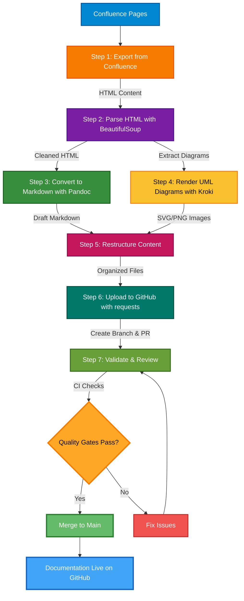

# Migrate HLD Documentation from Confluence to GitHub

---

## Table of Contents

- [1. WHY Documentation in GitHub?](#1-why-documentation-in-github)
- [2. Pros and Cons](#2-pros-and-cons)
  - [✅ Pros — Migrating to GitHub](#-pros--migrating-to-github)
  - [⚠️ Cons / Considerations](#️-cons--considerations)
- [3. Strategy](#3-strategy)
  - [a. Migrating Existing Documentation](#a-migrating-existing-documentation)
    - [Migration Process Overview](#migration-process-overview)
    - [Migration Toolchain Summary](#migration-toolchain-summary)
    - [1. Export from Confluence](#1-export-from-confluence)
    - [2. Parse HTML with BeautifulSoup](#2-parse-html-with-beautifulsoup)
    - [3. Convert to Markdown with Pandoc](#3-convert-to-markdown-with-pandoc)
    - [4. Render UML Diagrams with Kroki](#4-render-uml-diagrams-with-kroki)
    - [5. Restructure](#5-restructure)
    - [6. Upload to GitHub](#6-upload-to-github)
    - [7. Validate & Review](#7-validate--review)
  - [b. Templates for New Documentation](#b-templates-for-new-documentation)
- [4. Demo](#4-demo)
- [5. Questions](#5-questions)

---
 
## 1. WHY Documentation in GitHub?
 
- **Single Source of Truth** — Keep code and its design documentation in the same repository, eliminating context-switching between tools.
- **Version Control** — Every change to a document is tracked with full commit history, diffs, and blame.
- **Review Process** — Leverage Pull Requests for document reviews, approvals, and inline comments — the same workflow used for code.
- **Docs-as-Code** — Treat documentation with the same rigor as source code: linting, CI checks, and automated publishing.
- **Cost Optimization** — Reduce Confluence licensing costs by consolidating onto a platform the engineering team already pays for.
 
---
 
## 2. Pros and Cons
 
 
### ✅ Pros — Migrating to GitHub
 
| # | Topic | Detail |
|---|-------|--------|
| 1 | **Docs next to code** | Documentation and code changes ship in the same pull request, eliminating drift between the two. |
| 2 | **Full Git history** | Every change is versioned with author, timestamp, and commit message — a complete, tamper-evident audit trail. |
| 3 | **Pull request review** | Documentation goes through the same PR approval workflow as code, enforcing quality gates and governance. |
| 4 | **Native CI/CD** | GitHub Actions lints, spell-checks, and link-checks every Markdown file automatically before merge. |
| 5 | **Zero additional licence cost** | GitHub is already licensed across the organisation; Confluence's per-seat fee is eliminated entirely. |
| 6 | **Offline access** | A `git clone` gives engineers full documentation access without a VPN or network connection. |
| 7 | **Open, portable format** | Plain Markdown files are readable in any editor|
| 8 | **Native Mermaid diagrams** | GitHub renders Mermaid diagrams natively in the browser at no cost, replacing paid Confluence diagram macros. |
| 9 | **Consistent developer tooling** | VS Code, GitHub Copilot, and all standard dev tools work natively with Markdown, lowering the barrier to contribution. |
 
### ⚠️ Cons / Considerations
 
| # | Topic | Detail | Mitigation |
|---|-------|--------|------------|
| 1 | **Markdown learning curve** | Non-technical writers unfamiliar with Markdown need initial onboarding. | Short workshop + VS Code preview + GitHub Copilot assist eliminates most friction within days. |
| 2 | **Loss of Confluence macros** | Rich macros (status badges, roadmap timelines, inline tasks) have no 1-to-1 Markdown equivalent. | GitHub Discussions covers inline Q&A; MkDocs plugins and shields.io badges replicate most visual macros. |
| 3 | **No native inline page comments** | Confluence supports inline paragraph-level comments; GitHub does not replicate this outside of PRs. | GitHub Discussions threads can anchor to specific sections; PR comments serve this purpose during the review cycle. |
 
 
---
 
## 3. Strategy
 
### a. Migrating Existing Documentation

#### Migration Process Overview



**Migration Flow Table**

| Step | Phase | Tool | Input → Output |
|:----:|-------|------|----------------|
| **1** | **Export from Confluence** | `requests` + Confluence REST API | Confluence Pages → HTML Content |
| **2** | **Parse HTML with BeautifulSoup** | `BeautifulSoup` | HTML Content → Cleaned HTML + Extracted Elements |
| **3** | **Convert to Markdown with Pandoc** | `pandoc` (GFM) | Cleaned HTML → Draft Markdown |
| **4** | **Render UML Diagrams with Kroki** | Kroki API | Diagram Source → SVG/PNG Images |
| **5** | **Restructure** | Manual / Script | Draft Markdown + Images → Organized File Structure |
| **6** | **Upload to GitHub** | `git` | Organized Files → GitHub Branch |
| **7** | **Validate & Review** | PR + CI (link-check, linting) | GitHub PR → Approved Documentation |

---
 
#### 1. Export from Confluence
   - Export Confluence pages as HTML via the Confluence REST API.
   - Use Confluence REST API using Atlassian Bot account.
 
#### 2. Parse HTML with BeautifulSoup
   - Use `BeautifulSoup` to parse the exported HTML content.
   - Extract and clean the document body — strip Confluence-specific macros, inline styles, and wrapper `<div>` elements.
   - Identify and extract embedded image URLs (`` tags), table structures, and code blocks for proper downstream conversion.
   - Handle Confluence-specific elements (status macros, user mentions, page links) and map them to Markdown equivalents or plain text.
 
#### 3. Convert to Markdown with Pandoc
   - Pipe the cleaned HTML through `pandoc` to convert to well-structured Markdown:
     ```bash
     pandoc -f html -t gfm -o output.md input.html
     ```
   - Use GitHub Flavored Markdown (`gfm`) as the target format for native GitHub rendering.
   - Post-process the Pandoc output to fix any remaining formatting artifacts (broken tables, excess whitespace, heading levels).
 
#### 4. Render UML Diagrams with Kroki
   - Extract UML diagram source from Confluence pages (PlantUML, draw.io XML, Mermaid, etc.).
   - Send diagram source to the **Kroki** API to render as SVG/PNG:
     ```
     POST https://kroki.io/{diagram_type}/svg
     ```
   - Supported diagram types: PlantUML, Mermaid, and many more.
   - For PlantUML and other formats not natively supported by GitHub, render via Kroki API and save images to `docs/hld/{feature}/images/`.
   - For Mermaid diagrams, keep them as fenced code blocks since GitHub renders them natively.
   - Optionally preserve PlantUML source in collapsible sections for future re-rendering.
 
#### 5. Restructure
   - Organize documents in a consistent folder structure within the repo:
     ```
     docs/
     ├── hld/
     │   ├── feature-a/
     │   │   ├── hld-feature-a.md
     │   │   └── images/
     │   ├── feature-b/
     │   │   ├── hld-feature-b.md
     │   │   └── images/
     │   └── _templates/
     │       └── hld-template.md
     ```
 
#### 6. Upload to GitHub
   - Commit the converted Markdown files and images to a new branch:
     ```bash
     git checkout -b docs/hld-migration
     git add docs/
     git commit -m "docs: migrate HLD for Feature A from Confluence"
     git push origin docs/hld-migration
     ```
   - Open a Pull Request on GitHub for review.
 
#### 7. Validate & Review
   - Open a Pull Request for each migrated document.
   - Run link-check and Markdown linting CI jobs.
   - Get sign-off from document owners / mergers.
 
---

### b. Templates for New Documentation

Provide a standardized HLD template so all future documents are consistent.

> **📄 [View the HLD Template →](hld-template.md)**

Copy this template when creating a new High-Level Design document. Store it at `docs/hld/_templates/hld-template.md` in your repository and reference it in your `CONTRIBUTING.md`.
> **Tip:** Store the template at `docs/hld/_templates/hld-template.md` and reference it in your `CONTRIBUTING.md`.
