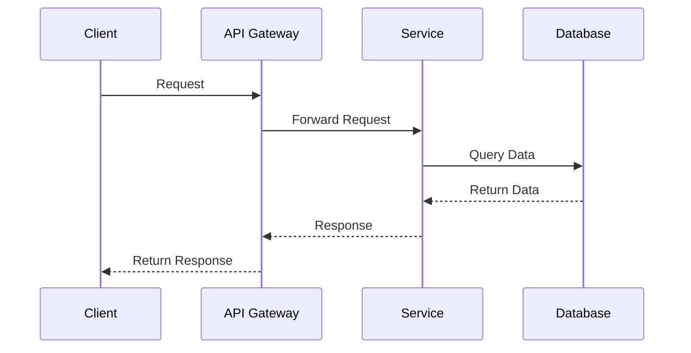
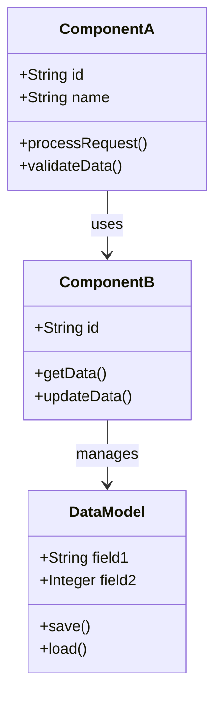
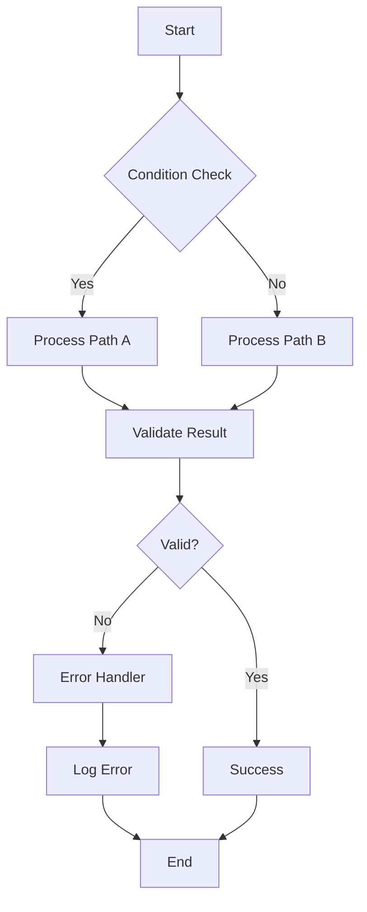
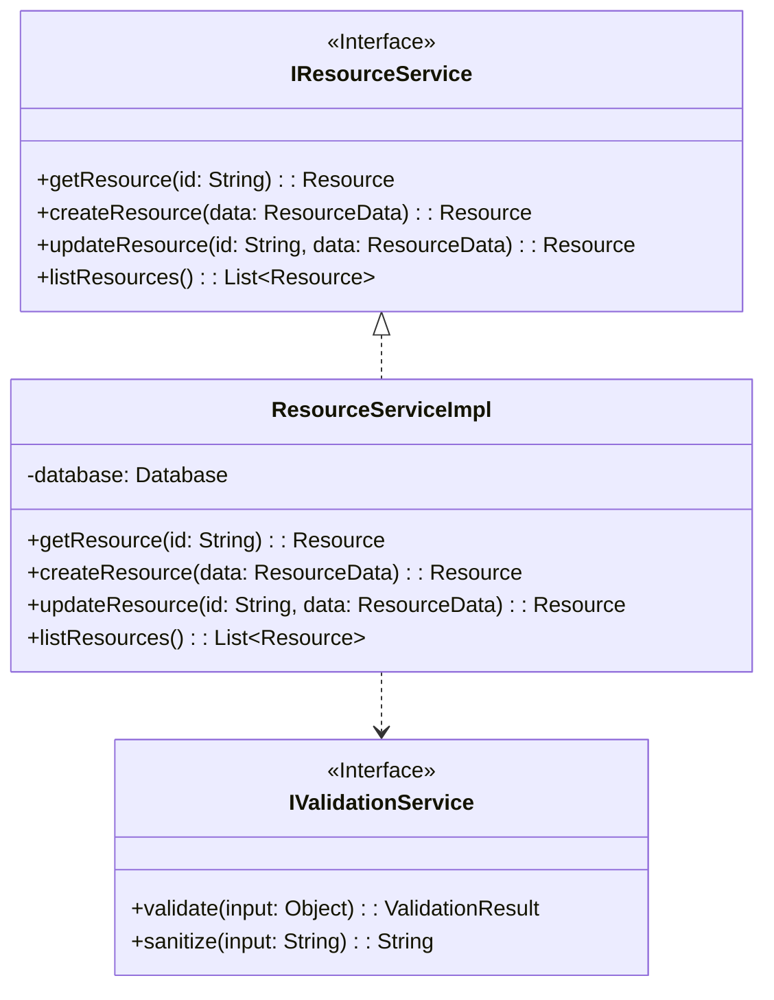
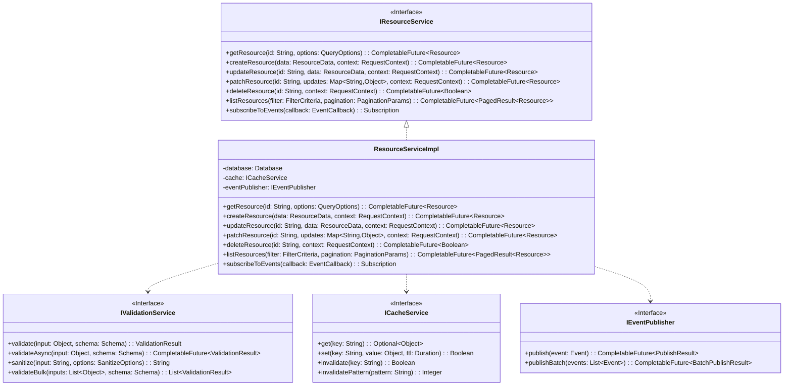
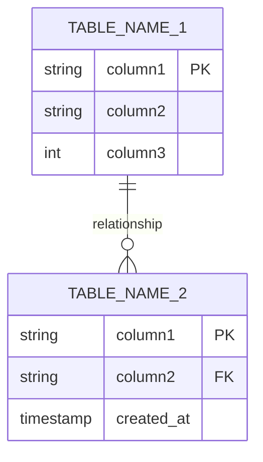

# [Service / Feature Name] — High-Level Design

## Table of Contents
- [1. Preface](#1-preface)
  - [1.1 References](#11-references) - mandatory
    - [1.1.1 Document references](#111-document-references)
    - [1.1.2 Creation and reviews](#112-creation-and-reviews)
- [2. Executive Summary](#2-executive-summary) - mandatory
- [3. Context](#3-context)
  - [3.1 Architecture principles](#31-architecture-principles)
  - [3.2 Technical Constraints](#32-technical-constraints)
  - [3.3 Technical Assumptions](#33-technical-assumptions)
  - [3.4 Discarded solutions](#34-discarded-solutions)
- [4. Technical Overview](#4-technical-overview) - mandatory
  - [4.1 Flow/Sequence Diagram](#41-flowsequence-diagram) - mandatory
  - [4.2 Class Diagram (detail design)](#42-class-diagram-detail-design) - optional
  - [4.3 Impacted Deployment units and Operational Details](#43-impacted-deployment-units-and-operational-details) - mandatory
  - [4.4 Impacted Fields/Methods (detail design)](#44-impacted-fieldsmethods-detail-design) - optional
  - [4.5 Introduced behavior](#45-introduced-behavior) - mandatory
  - [4.6 API updates](#46-api-updates) - mandatory
  - [4.7 Monitoring](#47-monitoring) - mandatory
- [5. Database Models](#5-database-models) - mandatory (explicit if not used)
  - [5.1 Example: Oracle/Couchbase/mongo](#51-example-oraclecouchbasemongo)
- [6. Non-functional Requirements Fulfillment](#6-non-functional-requirements-fulfillment)
  - [6.1 Application Design requirements](#61-application-design-requirements)
  - [6.2 Application Security requirements](#62-application-security-requirements)
  - [6.3 Data Management requirements](#63-data-management-requirements)
  - [6.4 Dev Life Cycle requirements](#64-dev-life-cycle-requirements)
- [7. Glossary](#7-glossary)
  - [7.1 Functional terms / acronyms](#71-functional-terms--acronyms)
  - [7.2 Project and technical terms / acronyms](#72-project-and-technical-terms--acronyms)
- [8. Appendices](#8-appendices)

---

## Document Metadata

| Field           | Value                        |
|-----------------|------------------------------|
| **Author(s)**   | John Doe, Jane Smith         |
| **Reviewer(s)** | Tech Lead, Solution Architect |
| **Status**      | Draft / In Review / Approved |
| **Created**     | 2026-04-08                   |
| **Last Updated**| 2026-04-08                   |
| **Version**     | 1.0                          |

---

## 1. Preface

This document should be reviewed in the Architecture Corner and presented in the DEV Forum.

### 1.1 References - mandatory

#### 1.1.1 Document references

| Ref | Title | Version | Link |
|-----|-------|---------|------|
| HLS Mandatory | | | |
| HANDOVER PAGE Mandatory | | | |
| Spec Overview Doc | | | |
| Assessment Page | | | |
| Test plan | | | |

#### 1.1.2 Creation and reviews

| Date | Description | Author |
|------|-------------|--------|
| | Written by | |
| | Reviewed by | |
| | Approved by | |

---

## 2. Executive Summary - mandatory

[Provide a brief executive summary of the high-level design. This should be a high-level overview that can be understood by non-technical stakeholders, covering the purpose, scope, and key decisions made in the design.]

---

## 3. Context

### 3.1 Architecture principles

Application Architecture Principles can be referred for applicable general principles to mention they are respected. If you wish you can list explicitly the principle you respect and those non applicable.

But what is more important is to mention if a principle is not going to be followed (quite unlikely though) to justify it (would need approval by Architect Lead).

This section is not only for these general principles but allow additional more detailed architecture principles defined at this application level to be listed.

**Applicable Principles:**
- [List architecture principles being followed]
- 

**Non-Applicable Principles:**
- [List principles not applicable with justification]
- 

**Application-Specific Principles:**
- [List any additional principles defined for this application]
- 

### 3.2 Technical Constraints

[Document technical constraints that impact the design, such as:]
- Technology stack limitations
- Infrastructure constraints
- Third-party integration requirements
- Compliance and regulatory requirements
- Performance requirements
- Budget constraints

### 3.3 Technical Assumptions

[Document key technical assumptions made during the design, such as:]
- Availability of certain services or APIs
- Data volume and growth projections
- User load and traffic patterns
- Network bandwidth and latency
- Team skill sets and availability

### 3.4 Discarded solutions

Details on the process that gave the chosen solution.

| Alternative Solution | Description | Reason for Rejection |
|---------------------|-------------|---------------------|
| [Solution 1] | [Brief description] | [Why it was discarded] |
| [Solution 2] | [Brief description] | [Why it was discarded] |

---

## 4. Technical Overview - mandatory

This chapter gives an overview of the application's main functionalities and the data entities with which the application interacts.

[Provide a high-level overview of the solution, including:]
- Main functionalities and features
- Key components and their interactions
- Data entities and their relationships
- Integration points with other systems

### 4.1 Flow/Sequence Diagram - mandatory

The diagram representing the detailed flow:

> **Note:** For PlantUML diagrams not natively supported by GitHub, render via Kroki API and save images to `docs/hld/{feature}/images/`. For Mermaid diagrams, keep them as fenced code blocks since GitHub renders them natively.

### 4.2 Class Diagram (detail design) - optional

Detailing the impacted Class diagram:

[Provide detailed class diagram showing impacted classes, their attributes, methods, and relationships]

### 4.3 Impacted Deployment units and Operational Details - mandatory

Details on the OBEs impacted and operational specificity:

| Unit | Details |
|------|---------|
| BMS component | [Specify BMS component details] |
| Backend Type | [Specify backend type: Stateless/Stateful/Batch] |
| Load Item | [Specify load item configuration] |
| OBE | [Specify OBE (Operating Business Entity) impacted] |

**Operational Details:**
- Deployment approach: [Blue-Green / Rolling / Canary]
- Rollback strategy: [Details]
- Monitoring requirements: [Specific metrics to track]
- Configuration changes: [Environment variables, feature flags, etc.]

### 4.4 Impacted Fields/Methods (detail design) - optional

Details on the Methods and fields touched.

| Class/Component | Method/Field | Type | Change Description |
|----------------|--------------|------|-------------------|
| [ClassName] | [methodName()] | Method | [Description of change] |
| [ClassName] | [fieldName] | Field | [Description of change] |
| [ClassName] | [methodName()] | Method | [Description of change] |

**Code Impact Summary:**
- New methods added: [count]
- Modified methods: [count]
- Deprecated methods: [count]
- New fields added: [count]
- Modified fields: [count]

### 4.5 Introduced behavior - mandatory

Details and explanations on the old and new behaviors. Also the algorithms description detailed in the diagram below.

#### Old Behavior

[Describe the current/old behavior of the system]

**Flow:**
1. [Step 1 of old behavior]
2. [Step 2 of old behavior]
3. [Step 3 of old behavior]

**Limitations:**
- [Limitation 1]
- [Limitation 2]

#### New Behavior

[Describe the new behavior being introduced]

**Flow:**
1. [Step 1 of new behavior]
2. [Step 2 of new behavior]
3. [Step 3 of new behavior]

**Improvements:**
- [Improvement 1]
- [Improvement 2]

#### Behavior Comparison

| Aspect | Old Behavior | New Behavior |
|--------|-------------|--------------|
| Performance | [Details] | [Details] |
| Data Flow | [Details] | [Details] |
| Error Handling | [Details] | [Details] |
| User Experience | [Details] | [Details] |

#### Algorithm Description

[Provide detailed explanation of the algorithm, including:]
- Input parameters and validation
- Processing logic and decision points
- Output format and structure
- Error handling and edge cases

### 4.6 API updates - mandatory

Details on the API changes: low/high level API updates (i.e., Services/messages updates) detailed if any.

#### Current API Interface (Before)

**Interface Diagram:**

---

#### New API Interface (After)

**Interface Diagram:**

---

### 4.7 Monitoring - mandatory

Details what need to be implemented to monitor the functionality (Kibana, Argos, Splunk, Sentinel, Error Viewer).

---

## 5. Database models - mandatory (explicit if not used)

Details of the data model changes if any. Link to seating data model here: **TOADD**

### 5.1 Example: Oracle/Couchbase/MongoDB

#### Database Model Diagram

**Figure 3 – Database model for Oracle**

*[Add ER diagram here using Mermaid or image reference]*

#### Table Definitions

| Table | Purpose |
|-------|---------|
| *[Table Name 1]* | *[Describe in a few sentences the purpose and specific characteristics of this table]* |
| *[Table Name 2]* | *[Describe in a few sentences the purpose and specific characteristics of this table]* |
| *[Table Name 3]* | *[Describe in a few sentences the purpose and specific characteristics of this table]* |

---

## 6. Non-functional requirements fulfillment

This chapter describes in summary how the major corporate non-functional requirements are addressed (refer to Nano).

While filling the HLD, it is the right time to log they have been reviewed and keep a trace of the work done in Nano in the application assessment section.

If the currently designed application is new and not yet listed in the reference list of application, it is the perfect time to request it's addition by pressing on the + button :

**Tip 1:** In Nano, assessment can be done per NFR (no more need to do a full application assessment) so you can do this step by step or share the work among various stakeholders of the design.

**Tip 2:** If this design relates to an existing application, previous Nano assessment answer can be re-used. Although critical eyes is required to review then if they need to be updated

### 6.1 Application Design requirements

### 6.2 Application Security requirements

### 6.3 Data Management requirements

### 6.4 Dev Life Cycle requirements

---

## 7. Glossary

### 7.1 Functional terms / acronyms

| Term / acronym | Definition |
|----------------|------------|
|  |  |
|  |  |
|  |  |

### 7.2 Project and technical terms / acronyms

| Term / acronym | Definition | Term / acronym | Definition |
|----------------|------------|----------------|------------|
|  |  |  |  |
|  |  |  |  |
|  |  |  |  |

---

## 8. Appendices

---

**Document History:**

| Version | Date | Author | Changes |
|---------|------|--------|---------|
| 1.0 | 2026-04-08 | John Doe | Initial draft |
| 1.1 | 2026-04-10 | Jane Smith | Added security section |
| 1.2 | 2026-04-12 | John Doe | Updated based on review feedback |
